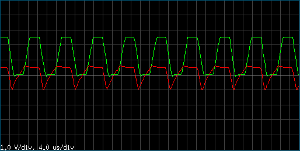

# ascope
An Arduino Uno oscilloscope, with an X Window control and viewer program.

## Features
* equivalent-time sampling rates 16 MSps, 2 MSps, 250 kSps, 62.5 kSps, and 15.625 kSps;
* 8-bit resolution;
* multiple channels.

## Hardware setup
The oscilloscope takes its input from the analog pins A0, A1, etc.
Aquisition is triggered when the voltage on the AIN0 pin rises above (or
falls below) that on the AIN1 pin.

## The principles of operation
Aquisition is started when an AC interrupt occurs. Time interval between
AC interrupt and ADC conversion is measured with the 16-bit
Timer/Counter1. This is facilitated by running the ADC in auto-trigger
mode, when the conversion is triggered by the Timer/Counter1 output
compare match. Sampling rate is switched by changing the TC1 clock
division factor.

Settings from the control program and data from the oscilloscope are
exchanged with the simple protocol, which is thoroughly documented in
the source. Hence, writing alternative control programs for the
oscilloscope should be easy.

## Limits
The analog bandwidth of the Arduino ADC input circuits is somewhere
about 200 kHz. More high-frequency signals are considerably distorted.

## Indication
The onboard LED is turned on while the acquisition is in progress.

## The X11 control and viewer program
#### Controls
key            | action
---------------|-------
`↓` `↑`        | Decrease or increase the time scale (μs/div) by switching to the next sampling rate
`/` `\`        | Trigger on rising or falling edge
`1`, `2`, etc. | Use 1, 2, or more (if compiled) channels
`<space>`      | Freeze or thaw
`d`            | Dump the raw data to `stderr`
`q`            | Quit

Pressing a mouse button will show the time and voltage values under the
pointer.

#### Screenshot
A 75 kHz multivibrator output along with the corresponding base voltage.

#### Customization
Since the Arduino ADC accepts input in the range 0-5 V only, one would
probably use an external conversion circuit to fit the signal being
studied to the range suitable for the ADC. The original voltage range
can be set with the `V_MIN` and `V_MAX` macros.

Other adjustable settings are:
* Number of samples in the buffer (must be set to the same value as in the sketch),
* Maximum number of channels,
* Grid steps (Volts/div and Samples/div),
* Window width and height,
* Device file name.

#### Compliance
The GUI source complies with the C99 standard and should compile on any
POSIX system with X11 support.

## License
The programs are in the public domain.
