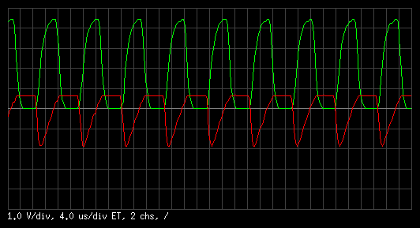

# ascope
An Arduino Uno oscilloscope.

## Features
* real-time sampling rates up to 300 kSps,
* equivalent-time sampling rates up to 16 MSps,
* 8-bit resolution,
* multiple channels.

## The principle of operation
The oscilloscope takes its input from the analog pins A0, A1, etc. In
the normal mode, acquisition is triggered when an AC interrupt occurs.
In the auto-trigger mode, acquisition starts immediately.

In the real-time sampling mode, the ADC is free-running. AC ISR polls
the ADC for conversion results and fills the output buffers. Sampling
rate is switched by changing the ADC clock division factor.

In the equivalent-time sampling mode, the time interval between an AC
interrupt and ADC conversion is measured with the 16-bit Timer/Counter1.
The conversion is triggered by the TC1 output compare match. ADC ISR
reads the conversion result and schedules the next one. Sampling rate is
switched by changing the TC1 clock division factor.

## Indication
The onboard LED is turned on while the acquisition is in progress.

## Limitations
The analog bandwidth of the Arduino ADC input circuits is not much above
100 kHz. Signals of higher frequency are considerably distorted.

## Control and data exchange protocol
The oscilloscope takes its settings from a single-byte control word:

and returns data in the following order:

See the source code for details.

## Control software
We provide a simple control program for Unix-like operating systems with
X11 graphics. It uses just plain `Xlib` and `libpng`. The program is
controlled mostly from keyboard:

## Example
A multivibrator running at 75 kHz (collector and base voltages):

A signal conditioning circuit for -5..+5 V inputs, used to produce
the above oscillogram:

## License
MIT.
